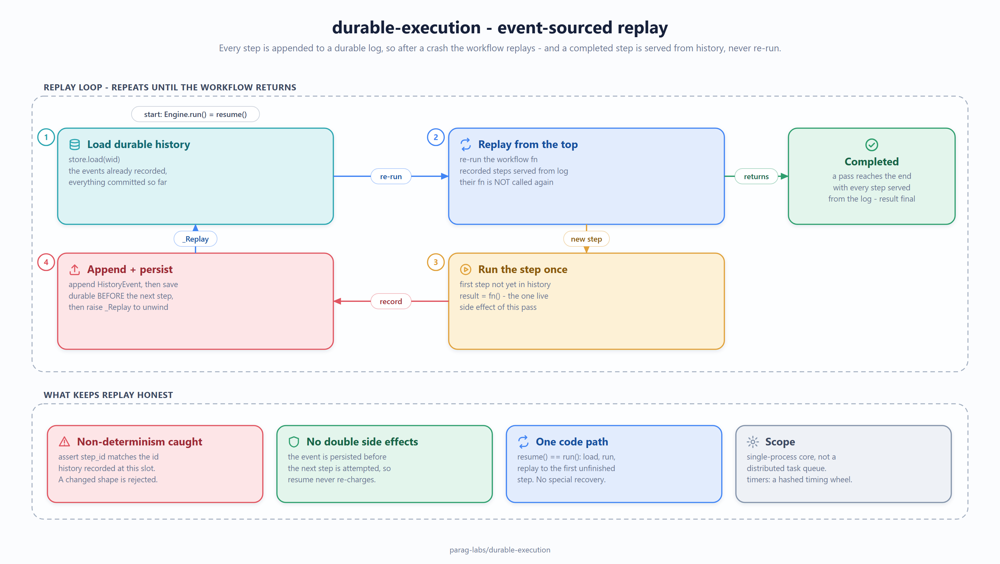

# durable-execution: design, trade-offs, and non-goals

Status: accepted
Author: Parag Sawant

Why durable-execution is built the way it is. Durable execution has one core trick -
replay a workflow from a durable history so completed steps don't run twice - and
the whole design is about making that trick correct and honest, then supporting it
with the timer structure these engines actually need.

## Problem and goals

Some workflows must complete exactly once even across crashes: charge, reserve,
notify. A plain script that crashes between two steps either loses the work or
repeats a side effect. Goals:

1. Let a workflow be **ordinary code**, not a state machine the author hand-rolls.
2. **Survive a crash** at any point and resume without repeating a completed side
   effect - no double charge.
3. Schedule the **many timers** these workflows imply (retries, timeouts, sleeps)
   without an O(log N) heap becoming the bottleneck.

## Key design decision: event-sourced replay

*(Source: [`docs/diagrams/event-sourced-replay.excalidraw`](docs/diagrams/event-sourced-replay.excalidraw) - editable in [excalidraw](https://aka.ms/excalidraw).)*

A workflow is a function that takes a `WorkflowContext`. The only way to do
anything with a side effect is `ctx.step(id, fn)`. The first time a step runs, its
result is appended to an append-only history and persisted *before* the next step
is attempted; the workflow then re-executes from the top. On that re-execution -
and on every future one, including after a crash - a step whose result is already
in the history returns that recorded value **without calling `fn` again**.

So "resume after a crash" and "continue normally" are the same code path: load the
durable history, run the function, and let replay walk it to the first unfinished
step. There's no separate recovery mode to get wrong. The tests exercise this
directly, including a workflow that raises (a simulated crash) right after its
first step is persisted, then resumes and completes without re-running that step.

## Key design decision: the workflow body must be deterministic - and that's enforced

Replay only reaches the right step if the function takes the same path every time.
That means no wall-clock reads, no unrecorded I/O, no unseeded randomness in the
body - anything non-deterministic has to go through a `step`, so its result is
captured. This is a real constraint, and rather than trust the author to honor it,
the engine checks: if replay reaches a step whose id doesn't match what history
recorded at that position, it raises instead of silently corrupting state. A test
covers exactly this - changing a step id between runs is rejected.

## Key design decision: a timing wheel, not a heap

Durable workflows are mostly waiting. A production engine tracks millions of live
timers, and a min-heap's O(log N) per operation plus poor cache behaviour makes it
the bottleneck. A hashed timing wheel buckets timers by fire time for O(1)
insertion and O(1) amortized per-tick work in the common case (a timer due within
one revolution). Timers further out sit in an overflow list and are re-homed onto
the wheel when they come into range. This wheel-plus-overflow design is what Kafka
and Netty use; I chose it over a multi-level cascade because a single wheel with
overflow is easier to verify correct, and correctness of the timer that fires your
retry matters more than shaving the far-future case.

## Trade-offs I made on purpose

- **Re-execute-from-top replay, not continuation capture.** Replaying the whole
  function each time a step is added is simpler and more portable than snapshotting
  a coroutine's stack, at the cost of re-walking history. For workflows of tens to
  hundreds of steps that's negligible, and it keeps the mental model - "your code,
  replayed" - honest.
- **In-memory history store.** `HistoryStore` is a dict behind a tiny
  load/save interface. Swapping in a database or a log is a change to one class;
  keeping it in memory keeps the tests deterministic and the core about replay.
- **Single wheel over a multi-level cascade.** Slightly less elegant for very
  far-future timers, materially easier to prove correct.

## Non-goals

- **Not a distributed task queue.** A real platform dispatches workflow tasks to a
  fleet of workers with leases and heartbeats. durable-execution is the single-process
  execution core - the replay engine and timers - not the cluster around it.
- **Not a persistence backend.** No database, no write-ahead log on disk; the store
  interface is where that would plug in, deliberately left as a seam.
- **No versioning / migration of in-flight workflows.** Changing a workflow's shape
  while instances are mid-flight is a hard, separate problem; here a changed shape
  is correctly *detected* as non-determinism rather than silently mishandled.
