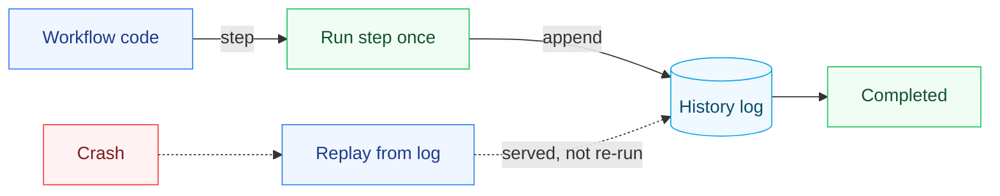

<h1 align="center">durable-execution</h1>

<p align="center">Durable execution — workflows written as ordinary code that survive process crashes and restarts by replaying an append-only history, so a completed step never runs twice.</p>

---

## Why this exists

Some code has to finish even if the machine running it dies halfway: charge the card, reserve the inventory, send the confirmation. Do that with a naive script and a crash between steps either drops the order or double-charges the customer. The durable-execution model — Temporal, AWS Step Functions, Azure Durable Functions — solves this by making the workflow **replayable**: every side-effecting step is recorded in a durable log, and after a crash the workflow function re-runs from the top with each already-completed step served from history instead of executed again.

durable-execution is a small, readable engine that does exactly that, plus the timer structure these systems live on.

## What it does

- **Event-sourced replay** — a workflow is a plain function; each `ctx.step(...)` is recorded in an append-only history. Re-running the function replays completed steps from history and continues live from the first unfinished one.
- **Crash safety = no double side effects** — a completed step is served from the log, so restarting after a crash never re-charges the card. The tests prove this across a simulated mid-workflow crash.
- **Non-determinism is caught, not hidden** — if a replay reaches a different step than history recorded, the engine raises instead of silently corrupting state.
- **Hashed timing wheel** — O(1) near-term timer scheduling with an overflow list for far-future timers, the structure durable engines use for their millions of "retry in 30s" timers.

## Quickstart

```python
from resumerun import Engine, HistoryStore

store = HistoryStore()

def order_workflow(ctx):
    payment = ctx.step("charge", lambda: charge_card(order))
    shipment = ctx.step("ship",   lambda: create_shipment(order))
    return {"payment": payment, "shipment": shipment}

# Runs to completion, persisting each step.
Engine(store).run("order-42", order_workflow)

# A fresh engine "resumes" the same workflow id against the durable history:
# charge and ship are served from the log — neither side effect fires again.
Engine(store).resume("order-42", order_workflow)
```

## Run it

```bash
pip install -e ".[dev]"
pytest
```

## Three languages, one behavior

The same replay engine and timing wheel — and the same 9 tests — in each language:

| Language | Tests | Run |
|----------|:-----:|-----|
| Python | 9 | `pytest -q` |
| C# (.NET 10) | 9 | `cd csharp && dotnet test` |
| Java (17+) | 9 | `cd java && mvn test` |

## Design

- **[DESIGN.md](DESIGN.md)** — the event-sourcing/replay model, why the workflow body must be deterministic and how the engine enforces it, the timing-wheel choice, and the honest non-goals (single-process reference; no distributed task queue, no real persistence backend).

## How it works



## Layout

```
durable-execution/
├── resumerun/          the engine (Python)
│   ├── engine.py       the event-sourced replay engine (a completed step never re-runs)
│   └── timing_wheel.py the hashed timing wheel the timers live on
├── csharp/             the same engine + timing wheel, ported to .NET 10 (xUnit)
├── java/               the same, in Java 17+ (JUnit / Maven)
├── tests/              crash-resume + timer-ordering tests
└── DESIGN.md           the replay model, determinism enforcement, the non-goals
```

## License

MIT — see [LICENSE](LICENSE).
